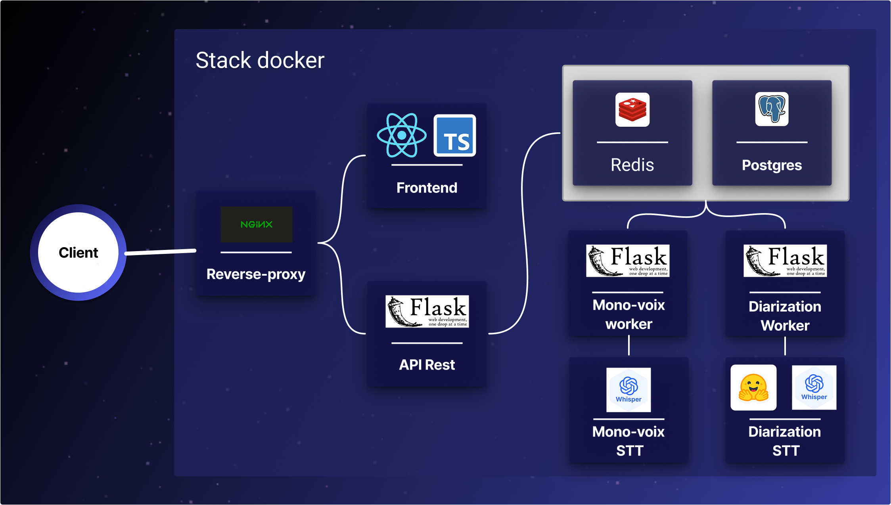

# TranscribeAI Suite

TranscribeAI vise à fournir une suite d’outils permettant la conversion rapide et fiable de contenus audio en texte, adaptée aussi bien aux usages professionnels qu’aux besoins individuels.
Ce dépôt fournit, une présentation de l'outil ainsi qu'un script de déploiement de l'outil sur une machine. 

## Sommaire

- [Présentation de TranscribeAI](#présentation-de-transcribeai)
    - [Fonctionnalités et modules](#fonctionnalités-et-modules)
    - [Architecture de l'app](#architecture-de-lapp)
    - [Mutualisation des services](#mutualisation-des-services)
- [Scripts de déploiement](#scripts-de-déploiement)
    - [Installer la stack depuis zéro](#installer-la-stack-depuis-zéro)
    - [Que fait le script de déploiement ?](#que-fait-le-script-de-déploiement-)

# Présentation de TranscribeAI

## Fonctionnalités et modules

TranscribeAI est un outil de retranscription vocale divisé en trois modules répondant à des cas d'usage distincts :

- <strong> 1. Transcription Mono-voix </strong>

Ce mode est optimisé pour le traitement de fichiers audio volumineux nécessitant une transcription brute mono-voix.

* Fonctionnalités clés : 

    - Téléversement et transcription d'un fichier audio à taille variable
    - Correction globale : Remplacement automatique de toutes les occurrences spécifiques mal retranscrites sur l'ensemble du texte. 
    - Synchronisation : Synchronisation du curseur de lecture bidirectionnelle «Audio to Text» et «Text to Audio».
    - Export multi-format : PDF, TXT, DOCX ou copie directe dans le presse-papier.
    - Barre d'alerte :
        - Position dans la file d'attente.
        - État de la tâche de transcription : PENDING, PROCESSING, FAILED ou COMPLETED
    - Validation de conformité du fichier (format et taille). 

> ⚠️ **Important**
> Ce mode n’est pas destiné à la micro-édition du texte.

- <strong> 2. Transcription réunions </strong>

Conçu pour la retranscription de conférences et réunions, permettant de séparer les différents intervenants ( locuteurs ).

* Fonctionnalités clés : 

    - Téléversement et diarisation d'un fichier audio à taille variable
    - Gestion des locuteurs 
        - Définition optionnelle du nombre minimum et maximum de participants.
        - Personnalisation visuelle (nom et couleur) pour chaque locuteur identifié.
    - Correction globale : Remplacement automatique de toutes les occurrences spécifiques mal retranscrites sur l'ensemble du texte. 
    - Synchronisation : Synchronisation du curseur de lecture bidirectionnelle «Audio to Text» et «Text to Audio».
    - Export multi-format : PDF, TXT, DOCX ou copie directe dans le presse-papier.
    - Barre d'alerte :
        - Position dans la file d'attente.
        - État du job : PENDING, PROCESSING, FAILED ou COMPLETED
    - Validation de conformité du fichier (format et taille).

> ⚠️ **Important**
> Ce mode n’est pas destiné à la micro-édition du texte.

- <strong> 3. Dictée vocale </strong> 

En cours de développement

## Architecture de l'app

L’architecture repose sur une approche orientée micro-services, favorisant la modularité, la scalabilité et l’isolation des composants.



- Composition de la Stack Docker
    - **Reverse Proxy** : Point d'entrée unique gérant le protocole HTTPS et le routage des requêtes.
    - **Frontend** : Interface utilisateur permettant de communiquer avec le Backend
    - **API REST** : Expose les endpoints, place les jobs ( tâches ) en file d'attente et récupère les résultats en base de données.
    - **Redis** : Broker de messages gérant deux files d’attente distinctes (mono-voix et diarisation)
    - **BDD** : Stockage des tâches de transcription/diarisation, de leurs états d’avancement et des résultats finaux. (Les données ne sont pas persistées.)
    - **Worker** : Agent surveillant les tâches en file d'attente et sollicitant les services dédiés.
    - **Mono-voix STT** : Chargé de retranscrire des fichiers audios
    - **Multi-voix STT** : Chargé de retranscrire et de diariser des fichiers audios

## Mutualisation des services

Chaque module de la stack possède son propre dépôt GitHub et son image Docker Hub.

| Nom du module | Dépôt GitHub | Image Docker Hub |
|--------------|-------------|------------|
| Reverse Proxy | [GitHub](https://github.com/Neilllllllll/TranscribeAI-ReverseProxy.git) | [Docker Hub](https://hub.docker.com/r/noeuil/transcribe-ai-reverse-proxy) |
| Frontend | [GitHub](https://github.com/Neilllllllll/TranscribeAI-Frontend.git) | [Docker Hub](https://hub.docker.com/r/noeuil/transcribe-ai-frontend) |
| Backend| [GitHub](https://github.com/Neilllllllll/TranscribeAI-Backend.git) | [Docker Hub](https://hub.docker.com/r/noeuil/transcribe-ai-api) |
| Worker diarisation | [GitHub](https://github.com/Neilllllllll/TranscribeAI-Backend.git) | [Docker Hub](https://hub.docker.com/r/noeuil/transcribe-ai-multi-voice-worker) |
| Worker Mono-voix | [GitHub](https://github.com/Neilllllllll/TranscribeAI-Backend.git) | [Docker Hub](https://hub.docker.com/r/noeuil/transcribe-ai-mono-voice-worker) |
| Mono-voix STT | [GitHub](https://github.com/Neilllllllll/TranscribeAI-Mono-voix-stt.git) | [Docker Hub](https://hub.docker.com/r/noeuil/transcribe-ai-mono-voice-stt) |
| Multi-voix STT | [GitHub](https://github.com/Neilllllllll/TranscribeAI-Multi-voix-STT.git) | [Docker Hub](https://hub.docker.com/r/noeuil/transcribe-ai-multi-voice-stt) |

# Scripts de déploiement

Scripts disponibles :
- [Installer la stack depuis zéro (première installation)](#installer-la-stack-depuis-zéro) 

## Installer la stack depuis zéro

### Déployer la stack sur une machine hôte

> ⚠️ **Prérequis importants**

---

#### **Prérequis 1 : Système d’exploitation**

Votre système d’exploitation doit être une distribution Linux.
(**Ubuntu 24.04 LTS recommandé**).

| Distributions testées |
|----------------------|
| [Ubuntu 24.04 LTS](https://ubuntu.com/download/desktop) |
| [Ubuntu 22.04 LTS](https://releases.ubuntu.com/jammy/) |

✅ Supporte WSL mais n’est pas recommandé.

Pour vérifier votre distribution :

`hostnamectl`

---

#### **Prérequis 2 : Accès à Internet**

Un accès à Internet est requis pour télécharger les images Docker.

Vérification :

`ping -c 3 8.8.8.8`

---

#### **Prérequis 3 : Docker et Docker Compose installés**

Docker et Docker Compose sont nécessaires pour récupérer et exécuter la stack.

Installation :

- [Docker](https://docs.docker.com/engine/install/)
- [Docker Compose](https://docs.docker.com/compose/install/)

Vérification :

`docker -v`  
`docker compose version`

---

#### **Prérequis 4 : GPU NVIDIA & drivers installés**

Requis pour l’accélération GPU des modèles STT.
Documentation officielle : https://docs.nvidia.com/datacenter/tesla/driver-installation-guide/introduction.html

Vérification :

`nvidia-smi`

---

#### **Prérequis 5 : NVIDIA Container Toolkit configuré**

Par défaut, Docker ne permet pas l’accès au GPU.  
Le NVIDIA Container Toolkit est nécessaire.

Documentation officielle :  
https://docs.nvidia.com/datacenter/cloud-native/container-toolkit/latest/install-guide.html

Vérification :

`sudo docker run --rm --gpus all ubuntu nvidia-smi`

---

#### **Prérequis 6 : Ports 80 et 443 disponibles**

Le reverse proxy mappe les ports `80` et `443` de la machine hôte.

Vérification :

`lsof -Pi :80 -sTCP:LISTEN -t`  
`lsof -Pi :443 -sTCP:LISTEN -t`

---

#### **Prérequis 7 : Générer un token Hugging Face**
Un token Hugging Face en mode "READ" est nécessaire pour télécharger les modèles IA utilisés par les services STT. 
Il vous faudra créer un compte Hugging Face si vous n’en avez pas déjà un, puis générer un token d’accès en suivant les instructions de la documentation officielle.

Documentation officielle : https://huggingface.co/docs/hub/security-tokens

---
#### **Prérequis 8 : Vérifier la version de Python et les modules nécessaires**
Le script de déploiement utilise un script Python pour la configuration des variables d’environnement.
Il est donc nécessaire d’avoir Python 3.9 ou supérieur installé, avec python3-venv pour la création d’un environnement virtuel et pip pour installer les dépendances Python.

Installer Python 3.9 ou supérieur et les modules nécessaires :

```bash
sudo apt update
sudo apt install python3 python3-venv python3-pip -y
```

Vérification de la version de Python :

```bash
python3 --version
```

Vérification de la présence de python3-venv :

```bash
python3 -m venv --help
```

Vérification de la présence de pip :

```bash
pip3 --version
```
---
#### **Prérequis 9 : Certificats HTTPS**

Pour activer HTTPS, fournir :

- `cert.crt` **ou** `cert.pem`
- `cert.key`

Dans :

`docker/volumes/certs/`

> Des certificats auto-signés peuvent être utilisés en environnement de développement ou de test.

Placé vous dans le dossier des ```docker/volumes/certs/``` :

```bash
cd docker/volumes/certs/
```

Génération d’un certificat auto-signé :

```bash
openssl req -x509 -newkey rsa:4096 \
  -keyout cert.key \
  -out cert.crt \
  -days 365 \
  -nodes \
  -subj "/C=FR/ST=France/L=Paris/O=TranscribeAI/CN=localhost"
```

#### Prérequis 10 (Optionnel) : Ajouter l'utilisateur au groupe Docker

Ajouter votre utilisateur au groupe Docker permet d’exécuter les commandes Docker sans avoir à rentrer le mot de passe sudo à chaque fois.

```bash
sudo usermod -aG docker $USER
```

```bash
sudo reboot
```

Vérification :

```bash
docker run hello-world
```

#### **Prérequis 10 : Fournir un logo personnalisé pour l’interface utilisateur.**

Pour cela ajouter une image nommée `logo.svg` dans le dossier `docker/volumes/assets/`.

---

### 🚀 **Lancer le script**

Une fois tous ces prérequis compléter, il est temps de lancer le script de déploiement. 
Pour cela vous devez donner les droits d'exécutions au fichier avec la commande : 

```bash
chmod +x deploy.sh
```

Puis lancer le script : 

```bash
./deploy.sh
```

Si tous les prérequis sont satisfaits, le script vous invitera à renseigner les variables d’environnement nécessaires au bon fonctionnement de la stack.
Chaque variable est accompagnée d’une description, d’un exemple de valeur et d'une valeur par défaut. Des mécanismes de validation sont appliqués afin de garantir la cohérence des informations saisies.
Il est possible de laisser certaines variables vides en laissant le champ vide. Dans ce cas, la valeur par défaut sera utilisée.
Certaines variables sont automatiquement renseignées par le script ; elles seront alors simplement affichées à titre informatif.

> ⚠️ **Important**
> Le premier lancement de la stack peut prendre plusieurs minutes, notamment en raison du téléchargement des images Docker et des modèles IA.

### Que fait le script de déploiement ?

Le fichier `deploy.sh` permet de déployer l’application sur une machine hôte. Il se compose de six étapes.

**Etape 1 : Nettoyage des ressources existantes**

- Suppression du fichier `config/.env` existant afin d’éviter toute incohérence de configuration
- Suppression des conteneurs issus d’une tentative précédente (le cas échéant)

> ⚠️ **Important**
> Cette étape supprime les tentatives de déploiements précédentes dont les données persistées ( conteneur, volumes et réseau virtuel )

**Etape 2 : Construction de la structure des dossiers et fichiers**

- Création / vérification des dossiers nécessaires : `docker`, `config`, `docker/volumes`
- Vérification de la présence des fichiers requis : `docker-compose.yml`, `.env.schema.yaml`

**3. Vérification des prérequis**

- Docker installé
- Docker Compose installé
- Drivers NVIDIA installés (si utilisation GPU)
- NVIDIA Container Toolkit installé (accès GPU via Docker)
- Ports `80` et `443` disponibles
- Python 3.9 ou supérieur installé
- Création d’un environnement virtuel Python

**4. Configuration des variables d’environnement**

Cette étape exécute un script Python qui :

- Charge le fichier `config/.env.schema.yaml`, contenant le modèle des variables d’environnement
- Valide et trie les variables
- Demande à l’utilisateur de renseigner les variables dont `mode: user`
- Applique des validateurs sur les valeurs saisies afin d’assurer leur cohérence
- Génère le fichier `config/.env`

**5. Déploiement de la stack**

- Exécution de la commande Docker Compose avec les variables définies

``` docker compose -f $COMPOSE_FILE --env-file $ENV_FILE -p $PROJECT_NAME up -d ```

**6. Vérification du bon fonctionnement des services**

- Vérification que les services sont correctement démarrés
