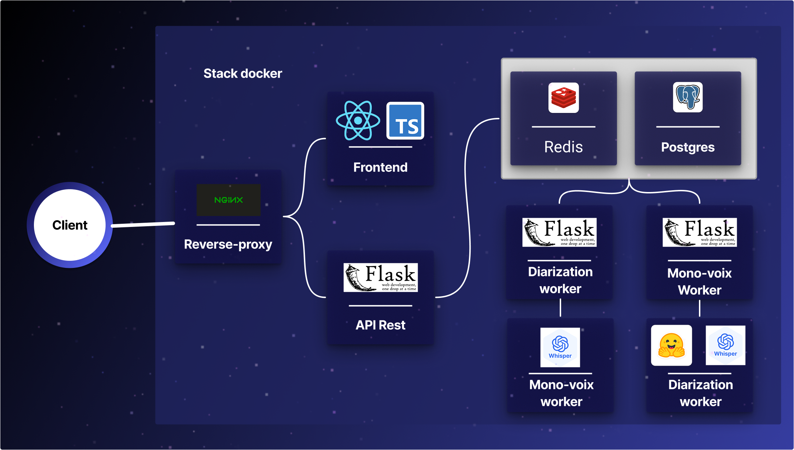

Prérequis : 
- Docker et docker compose d'installés et configurés pour utiliser les GPU NVIDIA (nvidia container toolkit)
- Driver NVIDIA installé et nvidia-smi doit fonctionner et afficher les GPU disponibles
- Ports nécessaires disponibles (ex: 80, 443 pour le reverse proxy ) 
- Certificats SSL dans le dossier volumes/certs/ (cert.crt et cert.pem) pour le reverse proxy (HTTPS)